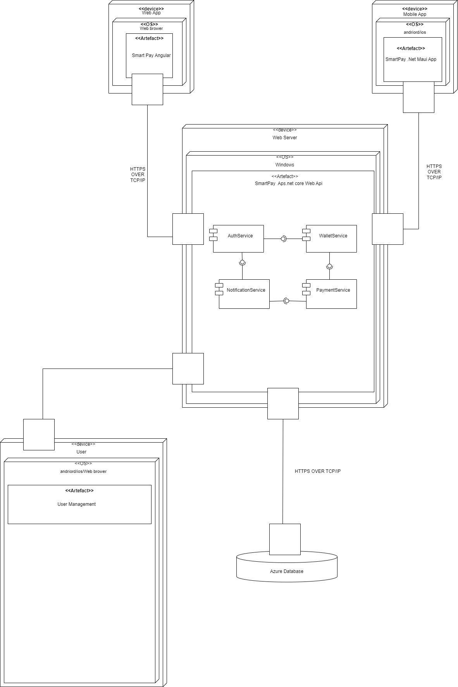

# 📱SmartPay Design

---
# ⚙️Functional Requirements

## Users should be able to:
- Register using email verification or OTP.
- Log in and log out securely from web or mobile.
- View and update their profile and account settings.
- Reset or change their password securely.

## Administrators should be able to:
- View and manage user profiles.
- Deactivate or flag user accounts for review.
- Assist users with account recovery.

## End Users should be able to:
- View their current wallet balance in real-time.
- Link and unlink multiple payment methods (credit cards, bank accounts).
- Make real-time payments to merchants or other users.
- Top up their wallet using external funding sources.
- View a full history of transactions, including dates, amounts, and status.

## External Payment Gateway/Bank Systems should be able to:
- Process and authorize user payments and top-ups.
- Send confirmation of successful or failed transactions.

## End Users should be able to:
- Receive real-time push or in-app notifications about payment success or failure.
- Get SMS or email alerts for verification, login attempts, or critical account actions.

## Administrators should be able to:
- Monitor all user transactions in the system.
- Access detailed user profiles and account activity.
- Flag suspicious transactions or users for investigation.
- Take administrative actions such as freezing accounts or rolling back transactions.
- Resolve user disputes and complaints regarding transactions.

## Administrators should be able to:
- Generate daily, weekly, and monthly transaction reports.
- View usage statistics such as top users or most common transaction types.
- Access audit logs of administrative actions taken.
- Track system performance and user growth metrics.

## End Users should be able to:
- Authenticate using secure, encrypted methods.
- Access their account only with proper credentials or 2FA.
- Receive alerts for login from new devices or suspicious activity.

## Administrators should be able to:
- Define and manage roles and access levels (admin vs. support staff).
- Ensure system compliance with PCI DSS and GDPR.
- Monitor system logs for anomalies or unauthorized access attempts.

---

## ⚙️ Non-Functional Requirements – Smart Pay Digital Wallet
1. Real-Time Notification Accuracy
100% of successful or failed wallet-related operations ( payments, top-ups, account linking) must trigger a real-time notification that is displayed to the user within 2 seconds of the operation’s completion.

2. OTP Delivery Timing
One-Time Passwords (OTPs) for login and registration must be delivered to the user via email or SMS within 5 seconds of the request being triggered.

3. Transaction Responsiveness
All user-initiated payment transactions must be reflected in the wallet balance and transaction history within 1.5 seconds on both web and mobile platforms.

4. Wallet Top-Up Reflection
Wallet top-up actions initiated via linked bank accounts or cards must reflect updated balances in the user's dashboard within 3 seconds of receiving external confirmation.

---
# 📌Development Methodology: Agile
SmartPay is being developed using the Agile methodology to allow for iterative progress, continuous feedback, and rapid adaptation to user needs and technical discoveries. Features are broken into prioritized sprints, enabling the team to deliver working functionality frequently and adjust direction based on stakeholder feedback or market conditions.

## Why Agile?

- Agile supports changing requirements – perfect for a fast-evolving fintech product like a digital wallet.

- It allows us to deliver an early MVP with core functionality (like registration, payments, and balance tracking), then expand features (e.g., reports, fraud detection, analytics) in future sprints.

- Frequent testing and feedback loops ensure security, performance, and usability are refined throughout development.

----
# 📊 Use Case Diagrams

Below are the key use cases represented visually.

 

---
# 🗃️ SmartPay Database Design Diagrams

---

# SmartPay Component&Deployement Design Diagram

---

# 🧰 SmartPay Technology Stack

SmartPay uses a modern, full-stack Microsoft and open-source ecosystem to deliver a scalable and cross-platform digital wallet experience.

---

## 🖥️ Frontend (Web)
- **Framework**: Angular 17
- **UI Libraries**: Angular Material, Bootstrap
- **State Management**: RxJS, Services
- **Testing**: Jasmine, Karma, Playwright (E2E)

---

## 📱 Frontend (Mobile)
- **Platform**: .NET MAUI
- **Target**: Android and iOS
- **Architecture**: MVVM with Dependency Injection
- **Testing**: NUnit, MAUI UITest or Appium

---

## 🌐 Backend (API)
- **Framework**: ASP.NET Core Web API (8.0+)
- **Architecture**: Clean Architecture with Dependency Injection
- **Security**: JWT Auth, IdentityServer 
- **Testing**: xUnit, Moq

---

## 🗄️ Database
- **Primary DB**: Microsoft SQL Server
- **ORM**: Entity Framework Core
- **Migrations**: EF Core Migrations
- **Testing**: In-memory provider or SQL Server Testcontainers

---

## 🛡️ Security
- HTTPS everywhere
- JWT tokens with role-based access
- 2FA ready (via email or SMS integration)
- Database encryption at rest

---

